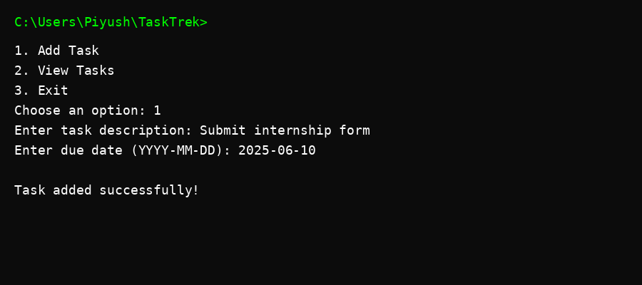

# TaskTrek – CLI Task & Reminder Manager

A lightweight C++ terminal-based task manager.

## Features
- Add new tasks with due dates
- View all tasks
- Modular design using STL

## Build Instructions

```
g++ main.cpp task_manager.cpp -o tasktrek
```

## Run
```
./tasktrek
```
## 📸 Screenshot

